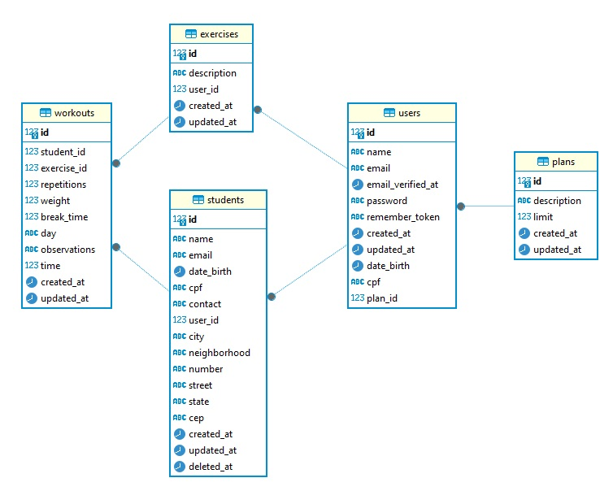

# API FitManage Tech

A API da FitManage Tech é uma ferramenta para gestão de instrutores e alunos, permitindo que instrutores cadastrem **_exercícios_** e criem **_treinos_** personalizados para seus alunos. Simplificando o processo, a plataforma visa otimizar a interação entre instrutores e alunos, proporcionando uma solução completa para o gerenciamento de academias e promovendo eficiência na personalização dos programas de treinamento.

## 🔧 Tecnologias utilizadas

Projeto foi desenvolvido utilizando a linguagem php com o framework laravel e banco de dados PostgreSQL.

### Vídeo de apresentação:

Seguem abaixo as depêndencias externas utilizadas:

| Plugin        | Uso                                            |
| ------------- | ---------------------------------------------- |
| Laravel       | Framework de modelagem da estrutura do backend |
| Dompdf        | Geração de PDF                                 |
| Sanctum       | Autenticação via tokens                        |
| Sail          | Configuração de ambientes Docker               |
| HttpResponses | Retornos das requisições                       |
| MailTrip      | Servidor para envios de e-mails                |

## 🧰 Técnicas e padrões utilizadas

O projeto foi construido utilizando a estrutura do framework laravel, onde e dividido em uma estruturas de pastas contendo os models, controllers, middlewares e database

### Modelagem da base de dados PostgreSQL

A modelagem do banco foi fornecida na documentação do projeto e ficou estruturada da seguinte maneira.



## 🚀 Como executar o projeto

-Clonar o repositório https://github.com/MarcelCNoronha/modulo-2-devinhouse.git

-Criar uma base de dados no PostgreSQL com nome **api_academia**

-Renomear o arquivo .env.exemple para .env na raiz do projeto e validar os seguintes parametros no arquivo:

-Ter o composer e o docker instalado.

```
DB_CONNECTION=pgsql
DB_HOST=127.0.0.1
DB_PORT=5432
DB_DATABASE=api_academia
DB_USERNAME=admin
DB_PASSWORD=admin
```

-No prompt de comando executar :

```sh
docker run --name academia -e POSTGRESQL_USERNAME=admin -e POSTGRESQL_PASSWORD=admin -e POSTGRESQL_DATABASE=api_academia -p 5432:5432 bitnami/postgresql
```

```sh
php artisan db:seed PopulatePlans
```

-Executar em seguida:

```sh
php artisan serve
```

## 🚑📗 Documentação da API

### 🚥 Endpoints - Rotas do Instrutor

#### S01 - Cadastro de Usuário

```http
  POST /api/users
```

| Parâmetro    | Tipo      | Descrição                                             |
| :----------- | :-------- | :---------------------------------------------------- |
| `id`         | `id`      | **Autoincremental**. Chave primaria                   |
| `name`       | `string`  | **Obrigatório**. Nome do instrutor, único.            |
| `email`      | `string`  | **Obrigatório**. e-mail do instrutor                  |
| `date_birth` | `date`    | **Obrigatório**. Data de nascimento                   |
| `cpf`        | `string`  | **Obrigatório**. CPF do instrutor, único e válido     |
| `password`   | `string`  | **Obrigatório**. Senha de login com 8 a 32 caracteres |
| `plan_id`    | `integer` | **Obrigatório**. Plano do usuário                     |

Request JSON exemplo

```http
    {
    "name": "Marcel Cardoso",
    "email": "marcelcardoso@gmail.com",
    "date_birth": "1994-02-12",
    "cpf": "9999999999",
    "password": "marcel123",
    "plan_id": 2
    }
```

| Response Status | Descrição   |
| :-------------- | :---------- |
| `201`           | Created     |
| `400`           | Bad Request |

Além disso e disparado um e-mail de cadastro utilizando o MailTrip

##

#### S02 - Login

```http
  POST /api/login
```

| Parâmetro  | Tipo     | Descrição                                             |
| :--------- | :------- | :---------------------------------------------------- |
| `email`    | `string` | **Obrigatório**. e-mail do instrutor                  |
| `password` | `string` | **Obrigatório**. Senha de login com 8 a 32 caracteres |

Request JSON exemplo

```http
    {
        "email": "marcelcardoso@gmail.com",
        "password": "marcel123",
    }
```

| Response Status | Descrição    |
| :-------------- | :----------- |
| `200`           | Ok           |
| `400`           | Bad Request  |
| `401`           | Unauthorized |

##

#### S3 - Dashboard

```http
  POST /api/dashboard
```

| Response Status | Descrição   |
| :-------------- | :---------- |
| `200`           | Ok          |
| `400`           | Bad Request |

Response JSON exemplo

```http
    {
    "registered_students": 19,
    "registered_exercises": 2,
    "current_user_plan": "PRATA",
    "remaining_students": 1
    }
```

##

### 🚥 Endpoints - Rotas dos Exercícios

#### S04 - Cadastro de exercícios

```http
  POST /api/exercises
```

Request JSON exemplo

```http
{
    "description": "Remada Alta"
}
```

| Response Status | Descrição   |
| :-------------- | :---------- |
| `201`           | Created     |
| `400`           | Bad Request |
| `409`           | Conflit     |

#### S05 - Listagem de exercícios

```http
  GET /api/exercises
```

Response JSON exemplo

```http
[
  {
    "id": 1,
    "description": "Descrição do exercício",
    "user_id": 43,
    "created_at": "2023-12-27T14:58:54.000000Z",
    "updated_at": "2023-12-27T14:58:54.000000Z"
  },
  {
    "id": 3,
    "description": "flexora",
    "user_id": 43,
    "created_at": "2023-12-27T20:53:33.000000Z",
    "updated_at": "2023-12-27T20:53:33.000000Z"
  }
]
```

| Response Status | Descrição   |
| :-------------- | :---------- |
| `200`           | Ok          |
| `400`           | Bad Request |

#### S06 - Deleção de exercícios

```http
  DELETE /api/exercises/{id}
```

| Response Status | Descrição   |
| :-------------- | :---------- |
| `204`           | Not Content |
| `409`           | Conflit     |
| `403`           | Forbidden   |
| `404`           | Not Found   |

### 🚥 Endpoints - Rotas dos Estudantes

#### S07 - Cadastro de estudante

```http
  POST /api/students
```

Request JSON exemplo

```http
    {
    "name": "Teste9",
    "email": "Teste9@example.com",
    "date_birth": "2000-01-01",
    "cpf": "88898888910",
    "contact": "88888888810",
    "cep": "12345-678",
    "street": "Rua do Estudante",
    "state": "SP",
    "neighborhood": "Bairro do Estudante",
    "city": "Cidade do Estudante",
    "number": "123"
    }
```

| Response Status | Descrição   |
| :-------------- | :---------- |
| `201`           | Created     |
| `400`           | Bad Request |
| `403`           | Forbidden   |

#### S08 - Listagem de estudantes

```http
  GET /api/students
```

Response JSON exemplo

```http
[
  {
    "id": 2,
    "name": "Marcel",
    "email": "novoemail@example.com",
    "date_birth": "1990-01-01",
    "cpf": "123.456.789-09",
    "contact": "987654321",
    "user_id": 43,
    "city": "Nova Cidade",
    "neighborhood": "Novo Bairro",
    "number": "456",
    "street": "Nova Rua",
    "state": "SP",
    "cep": "12345-678",
    "created_at": "2023-12-27T16:13:17.000000Z",
    "updated_at": "2023-12-29T21:25:49.000000Z",
    "deleted_at": null
  },
  {
  }
]
```

| Response Status | Descrição   |
| :-------------- | :---------- |
| `200`           | Ok          |
| `400`           | Bad Request |

#### S09 - Deleção de estudante (Soft Delete)

```http
  DELETE /api/students/{id}
```

| Response Status | Descrição   |
| :-------------- | :---------- |
| `204`           | Not Content |
| `403`           | Forbidden   |
| `401`           | Not Found   |

#### S10 - Atualização de estudante

```http
  PUT /api/students/{id}
```

Request JSON exemplo

```http
{
    "name": "Marcel",
    "email": "novoemail@example.com",
    "date_birth": "1990-01-01",
    "cpf": "123.456.789-09",
    "cep": "12345-678",
    "street": "Nova Rua",
    "state": "SP",
    "neighborhood": "Novo Bairro",
    "city": "Nova Cidade",
    "number": "456",
    "contact": "987654321"
}
```

| Response Status | Descrição   |
| :-------------- | :---------- |
| `200`           | Ok          |
| `400`           | Bad Request |

### 🚥 Endpoints - Rotas dos Treinos

#### S11- Cadastro de treinos

```http
  POST /api/workouts
```

Request JSON exemplo

```http
{
  "student_id": 20,
  "exercise_id": 3,
  "repetitions": 10,
  "weight": 50.5,
  "break_time": 60,
  "day": "SEGUNDA",
  "observations": "Observações opcionais",
  "time": 120
}

```

| Response Status | Descrição   |
| :-------------- | :---------- |
| `201`           | Created     |
| `400`           | Bad Request |
| `409`           | Conflit     |

#### S12 - Listagem de treinos do estudante

```http
  GET /api/students/{id}/workouts
```

Response JSON exemplo

```http
{
  "QUARTA": [
    {
      "id": 2,
      "student_id": 2,
      "exercise_id": 1,
      "repetitions": 10,
      "weight": "50.50",
      "break_time": 60,
      "day": "QUARTA",
      "observations": "Observações opcionais",
      "time": 120,
      "created_at": "2023-12-27T19:42:25.000000Z",
      "updated_at": "2023-12-27T19:42:25.000000Z"
    }
  ],
  "SEGUNDA": [
    {
      "id": 1,
      "student_id": 2,
      "exercise_id": 1,
      "repetitions": 10,
      "weight": "50.50",
      "break_time": 60,
      "day": "SEGUNDA",
      "observations": "Observações opcionais",
      "time": 120,
      "created_at": "2023-12-27T19:28:17.000000Z",
      "updated_at": "2023-12-27T19:28:17.000000Z"
    }
  ]
}
```

| Response Status | Descrição   |
| :-------------- | :---------- |
| `200`           | Ok          |
| `400`           | Bad Request |

#### S13 - Listagem de um estudante

```http
  GET /api/students/{id}
```

Response JSON exemplo

```http
{
  "id": 2,
  "name": "Marcel",
  "email": "novoemail@example.com",
  "date_birth": "1990-01-01",
  "cpf": "123.456.789-09",
  "contact": "987654321",
  "user_id": 43,
  "city": "Nova Cidade",
  "neighborhood": "Novo Bairro",
  "number": "456",
  "street": "Nova Rua",
  "state": "SP",
  "cep": "12345-678",
  "created_at": "2023-12-27T16:13:17.000000Z",
  "updated_at": "2023-12-29T21:25:49.000000Z",
  "deleted_at": null
}
```

| Response Status | Descrição   |
| :-------------- | :---------- |
| `200`           | Ok          |
| `400`           | Bad Request |

#### S14 - Exportação de PDF

```http
  GET /api/students/export
```

| Response Status | Descrição   |
| :-------------- | :---------- |
| `200`           | Ok          |
| `400`           | Bad Request |

## Autor

|                                                                                                                                             |                                                                                       |
| :------------------------------------------------------------------------------------------------------------------------------------------ | :------------------------------------------------------------------------------------ |
|  | Marcel Cardoso de Noronha :: [@MarcelCNoronha](https://www.github.com/MarcelCNoronha) |

###
